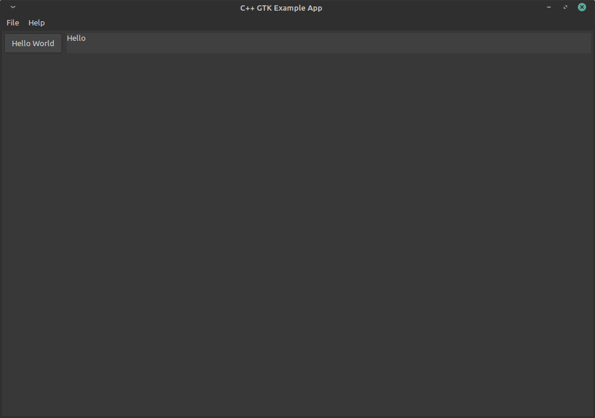

# GTK/Gtkmm Test Application

Test application using Gtk/Gtkmm C++.

This repository can also be used as a good Gtkmm template!

For a C example using GTK, [see this other repository](https://github.com/danger89/c-gtk-test-app).

